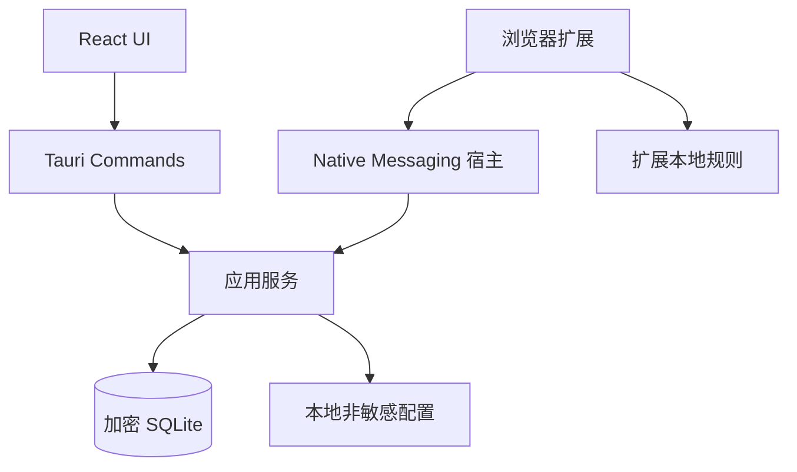

# 净界｜技术架构、数据与隐私设计

版本：v0.1 · 对应《01-产品需求与验收》

## 1. 技术选型与边界

- Linux 首发：Tauri 2 + React + TypeScript + Rust；单仓库、单 Cargo crate。持久化经 Rust command/application 层访问，不把通用 SQL 权限交给前端。
- UI：React Router 或等价本地路由、CSS 变量设计令牌；页面按 feature 拆分；无 CDN 依赖。
- 数据：应用初始化时建立经验证的加密 SQLite 存储；SQLCipher 是候选，但发布前验证 Linux 打包和密钥处理。不得先以明文 SQLite 开发正式用户数据，再把加密排到最后。
- 密钥：用户主密码经适当参数的内存困难 KDF 派生数据密钥包装密钥；随机数据密钥加密数据库。具体 Argon2id 参数以目标机性能测试决定并版本化。应用仅在解锁后持有内存密钥，锁定时清理可清理的敏感缓冲。Linux Secret Service 可作为可选便捷解锁，不作为唯一恢复路径；不能把 PIN 当独立的低强度加密密码。
- 备份：版本化元数据 + 密文数据 + 完整性校验；设计恢复预演。OS 文件权限限制（用户目录 0700、文件 0600）作为补充，不替代加密。
- 单实例：第二次启动聚焦现有窗口；托盘和开机启动让用户可选，默认不开启；全局热键注册失败明确呈现。

## 2. 模块拓扑



宿主应为单独轻量二进制／模式，通过 stdin/stdout 遵守原生消息协议，不直接执行 GUI 进程；仅允许明确扩展 ID 访问，消息按 schema 校验，接口限于读取规则版本和上报可选匿名命中计数。扩展本地规则能在桌面 UI 未运行时生效。与宿主断开时不静默改变策略。Firefox 和 Chromium 的原生消息清单字段与安装路径不同，分别打包与测试。

## 3. 表结构建议

表内敏感字段及整个数据库均受加密库保护；字段 `id` 为随机 UUID，`created_at`、`updated_at` 用 UTC ISO8601 或整数 epoch 毫秒，迁移含 `schema_version`。

| 表 | 核心字段 | 约束 |
| --- | --- | --- |
| `goal` | id, kind, title, status, created_at, archived_at | kind 枚举；历史不随归档删除 |
| `behavior_event` | id, type, occurred_at, zone_id, intensity?, note?, duration_sec?, created_at, updated_at | 不存网站 URL；可补记；强度 0–10 |
| `event_trigger` | event_id, code | 复合主键；外键级联删除 |
| `urge_session` | id, started_at, ended_at?, initial_intensity?, final_intensity?, step?, outcome? | 允许跳过及未完成 |
| `daily_checkin` | date_local, zone_id, mood?, stress?, sleep?, note? | 同一天可更新；全部可选 |
| `plan_action` | id, goal_id, title, frequency, enabled | 计划可暂停 |
| `action_completion` | id, action_id, occurred_at | 删除计划前保留历史语义 |
| `journal_entry` | id, content, created_at, updated_at | 标题非必需；锁屏隐藏 |
| `block_rule` | id, kind, normalized_pattern, schedule_json, enabled, priority, updated_at | 先支持 domain/allow；规则版本全局递增 |
| `block_pause` | id, requested_at, eligible_at, confirmed_at?, expires_at?, status | 到期按持久化时间校验；重启不中断 |
| `settings` | key, value | 仅非秘密配置可独立存储 |
| `schema_migration` | version, applied_at | 向前迁移及备份兼容校验 |

禁止把事件、日记、浏览命中记录写进开发控制台、遥测和崩溃报告。浏览器扩展只存规则，默认不存访问历史。域名先标准化 IDNA、小写与端点边界；允许列表明确优先级，禁止用字符串包含关系导致 `example.com.evil` 误命中。

## 4. 命令契约草案

```ts
type BehaviorType = 'urge' | 'viewed_content' | 'stopped_viewing' | 'masturbation' | 'alternative_action';
type UrgeOutcome = 'redirected' | 'continued' | 'unsure' | 'interrupted';
type BlockStatus = 'not_installed' | 'disconnected' | 'active' | 'stale' | 'paused';

type BehaviorInput = {
  type: BehaviorType;
  occurredAt: string;    // ISO 8601 timestamp
  timeZone: string;      // IANA zone
  intensity?: number;    // 0..10
  triggers?: string[];
  note?: string;
};

type Insights = {
  from: string; to: string;
  loggedDays: number;
  eventCounts: Record<BehaviorType, number>;
  intensitySamples: number;
  averageIntensity?: number;
  hourlyDistribution: Array<{ hour: number; count: number }>;
  triggerCounts: Array<{ trigger: string; count: number }>;
};
```

命令例：`initializeVault`, `unlockVault`, `lockVault`, `createBehaviorEvent`, `updateBehaviorEvent`, `deleteBehaviorEvent`, `listBehaviorEvents`, `startUrgeSession`, `finishUrgeSession`, `getInsights`, `saveGoal`, `listJournal`, `saveJournal`, `getBlockStatus`, `updateBlockRules`, `requestBlockPause`, `confirmBlockPause`, `createEncryptedBackup`, `previewRestore`, `restoreBackup`。每个命令须在 Rust 边界验证输入和解锁状态；前端不能直连数据库。返回标准错误码 `LOCKED`, `VALIDATION`, `CONFLICT`, `IO`, `CRYPTO`, `UNSUPPORTED`，用户界面给可恢复指引。

## 5. 安全与可靠性威胁模型

| 情形 | 预期处理 |
| --- | --- |
| 同机他人访问用户目录 | 数据库与备份密文、严格权限、应用自动锁定；不宣称能抵御已控制当前会话的恶意程序 |
| 忘记密码 | 无服务端恢复；进入只读引导并可新建空库，操作前说明旧数据不可恢复 |
| 系统快照、WAL、日志、剪贴板 | 使用加密库，审计临时文件；默认不复制敏感内容到剪贴板，复制时提示清理 |
| 恶意扩展消息 | 固定扩展 ID、最小宿主 API、输入验证、长度和频率限制；不得给任意 SQL/文件系统能力 |
| 扩展停用 / 换浏览器 / 代理绕过 | 明确显示每个浏览器的覆盖状态，不保证系统全局拦截 |
| 错误时间 / 时区变化 | 保存 UTC+IANA 时区，冷静期使用持久化时间和运行时单调时钟交叉校验，异常时要求重新计时而非提前放行 |
| 规则更新失败 | 保持旧版本，标注旧版本号与上次同步时间，提供重试 |
| 导入损坏文件 | 临时位置验证，事务性替换，失败保持原库 |

## 6. 工程目录与实施切片

```text
mindguard/
├── src/
│   ├── app/              # 路由、全局锁屏、主题
│   ├── features/         # onboarding, today, records, sos, plan,
│   │                     # insights, journal, blocker, settings
│   ├── components/       # 按设计规范复用的基础控件
│   └── styles/           # tokens, layout, typography
├── src-tauri/
│   ├── src/{commands,application,domain,infrastructure}/
│   ├── migrations/
│   └── capabilities/
├── extensions/
│   ├── shared/
│   ├── firefox/
│   └── chromium/
├── native-host/
├── docs/
└── tests/
```

切片顺序：① 启动/建库/解锁 → ② 事件 CRUD 与统计 → ③ SOS/计划/日记 → ④ Firefox 规则与拦截 → ⑤ Chromium/托盘/发布。每片可运行、可演示。避免提前建立六层企业 DDD 模块；Rust `domain` 定义规则，`application` 编排用例，`infrastructure` 接管加密存储与宿主适配，`commands` 只作验证与映射。

## 7. 官方资料与需核实项

- [Tauri 2 Linux 插件与能力](https://v2.tauri.app/plugin/)；[Autostart 与 capabilities](https://v2.tauri.app/plugin/autostart/)。实际打包前核对 WebKitGTK/系统依赖及 Ubuntu 包目标。
- [MDN declarativeNetRequest](https://developer.mozilla.org/en-US/docs/Mozilla/Add-ons/WebExtensions/manifest.json/declarative_net_request)、[Firefox/Chrome 差异及 native messaging](https://developer.mozilla.org/en-US/docs/Mozilla/Add-ons/WebExtensions/Chrome_incompatibilities)。扩展使用的 Manifest、动态规则和浏览器版本须在实现时再次查官方兼容表。
- SQLCipher/Tauri Stronghold 的组合及 Linux 凭据存储方案仅是候选；完成威胁建模、打包验证和密钥恢复设计后才固定依赖。不要在 PRD 中承诺“永远无法绕过”。
